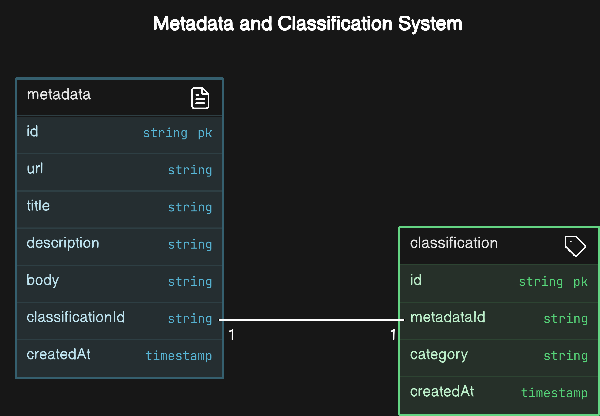

# Web Crawler System Design Document

The purpose of this system is to Crawl Data from webpages provided through a text file, extract meaningful information and use it to provide analytical information. For this we will solve this problem using distributed systems and microservices so that our system can have improved performance and scalability.

## Requirements

### Functional

1. **URL Ingestion**:
   - The system should accept file uploads containing URLs via an API.
   - Extract URLs from uploaded files and enqueue them for processing.

2. **Web Crawling**:
   - Fetch web pages from the provided URLs.
   - Extract metadata such as title, description, and body content.

3. **Metadata Storage**:
   - Store extracted metadata in a database.
   - Ensure metadata is linked to its source URL.

4. **Content Classification**:
   - Classify metadata using an external API (e.g., OpenAI).
   - Store classification results in a separate collection.

5. **Monitoring and Alerts**:
   - Provide real-time monitoring of system performance.
   - Generate alerts for critical issues.

6. **Retry Mechanism**:
   - Implement a retry mechanism for failed requests due to rate limits or transient errors.

### Non-Functional

1. **Scalability**:
   - The system should handle a large volume of URLs and scale horizontally.

2. **Reliability**:
   - Ensure high availability and fault tolerance.

3. **Performance**:
   - Optimize for low latency in processing and classification.

4. **Security**:
   - Secure API endpoints and data storage.

5. **Maintainability**:
   - Code should be modular and easy to maintain.

6. **Observability**:
   - Provide comprehensive logging and metrics for system operations.

## SLA

1. **Service Availability**: 99.9% uptime.
2. **Response Time**: Average API response time under 200 milliseconds.
3. **Data Processing Time**: Process and classify metadata within 5 minutes.
4. **Support**: 24/7 support with 1-hour response time for critical issues.
5. **Incident Resolution**: Resolve critical incidents within 4 hours.

## SLO

1. **Crawling Throughput**: 95% of URLs processed within 10 minutes.
2. **Classification Accuracy**: 90% accuracy based on manual review.
3. **Error Rate**: Less than 1% error rate.
4. **Queue Processing**: 99% of messages processed within 5 minutes.
5. **Monitoring and Alerts**: 95% of critical issues detected and alerted within 5 minutes.

## Architecture

  

### Components

1. **API Server**: Handles file uploads and sends URLs to the message queue.
2. **RabbitMQ**: Manages queues for URL processing, retries, and insights.
3. **Queue Consumer Service**: Processes messages for crawling and classification tasks.
4. **MongoDB**: Stores metadata and classification results.
5. **Crawler Service**: Crawls html page from a provided url,extracts metadata and stores it on MongoDB.
6. **Watcher Service**: Monitors new metadata entries and enqueues them for classification.
7. **Insight Service**: Creates insights like which category the page belongs to and stores it in a different collection using Open AI API.
8. **OpenAI API**: Classifies metadata content.
9. **Prometheus and Grafana**: Monitors overall system Performance.

## Data Model



### Data Flow

1. **File Upload**: Users upload files containing URLs to the API server.
2. **URL Queue Producer**: The API server enqueues URLs for processing.
3. **URL Queue Consumer**: The consumer fetches web pages and stores `metadata`.
4. **Insight Queue Producer**: New metadata entries are enqueued at the insight Queue via the `Watch Service`.
5. **Insight Queue Consumer**: Insights are calculated by calling an Open AI api , providing a prompt and store in `classification` collection.
6. **Monitoring**: Each service creates metrics of the overall system performance.
7. **Logging**: Every service uses logs to store some information incase of failures.

## Implementation

### Dependencies

The `package.json` file contains the list of all the dependencies used in the system.

```json
{
  "dependencies": {
    "amqplib": "^0.10.5", <-- Message Broker client
    "axios": "^1.7.8", <-- making api calls 
    "cheerio": "^1.0.0", <-- extracting metadata from html page
    "dotenv": "^16.4.5", <-- loading environmental variables
    "express": "^4.21.1", <-- api server framework
    "mongodb": "^6.11.0", <-- database
    "mongoose": "^8.8.3",<-- ORM for database
    "multer": "^1.4.5-lts.1", <-- for file upload
    "node-schedule": "^2.1.1", <-- scheduling for retry mechanism / rate limit
    "openai": "^4.73.1", <-- calling open ai api service
    "prom-client": "^15.1.3", <-- monitoring client
    "robots-parser": "^3.0.1", <-- handling robots.txt
    "winston": "^3.17.0" <-- centralized Logging
  }
}
```

### Features

- **Honouring Robots.txt**: We check the root of the provided URL for the `robots.txt` file and ensure that the URL we are trying to fetch is allowed to be fetched.

- **Security**: Secures API endpoints and data storage.

- **Centralized Logging**: We use a logger framework to collect logs from all different modules. The idea is to parse them together to form a single log file and later store it in Amazon S3. This allows us to debug errors in the system faster.

- **Handling Rate Limits for URLs**: Certain URLs have rate limits to prevent DDOS attacks or reduce server load. To manage this, we have three queues:
  1. **URL Queue**: From which we retrieve URLs to crawl.
  2. **Retry Queue**: We insert URLs after a time interval using scheduling to ensure they can be crawled later when we hit the rate limit.
  3. **Recycler Queue**: If we keep hitting the rate limit or the target URL is down, after a maximum number of retries, the URL is sent here to be discarded by the administrator.

- **Observability (APM / KPIs)**: We use the Prometheus client to store system performance data (CPU/Memory/Network usage) and key performance indices like the number of crawls, successful crawls, errors, and total crawls,etc. This provides monitoring information about our system.

- **Faster Querying**: We have created an index script to make queries faster when retrieving data from the metadata collection in the database. This ensures that the watcher service can work faster.

- **Leveraging LLM**: Introducing LLMs into the workflow of our system using the insight service creates meaningful classification of our websites.

- **Exception Handling**: To avoid service failures or restarts due to unforeseen circumstances.

- **Scaling**: Since all our different services are based on asynchronous processing, incase of higher number of requests we can easily scale by creating more worker processes, or if on `K8` / `Docker` create more containers/pods.

### Observable Metrics:

1. **Crawl Requests Total**  
   - **Metric Name**: `crawl_requests_total`  
   - **Description**: Total number of crawl requests processed by the system.  
   - **Purpose**: Helps track the volume of URLs being processed over time.  

2. **Crawl Errors Total**  
   - **Metric Name**: `crawl_errors_total`  
   - **Description**: Total number of errors encountered during the crawling process.  
   - **Purpose**: Identifies issues in the crawling process and helps in debugging.  

3. **Retry Requests Total**  
   - **Metric Name**: `retry_requests_total`  
   - **Description**: Total number of retry requests made due to rate limits or transient errors.  
   - **Purpose**: Monitors the effectiveness of the retry mechanism and identifies potential issues with external services.  

4. **Messages Processed Total**  
   - **Metric Name**: `messages_processed_total`  
   - **Description**: Total number of messages processed from the queue.  
   - **Purpose**: Provides insights into the throughput of the message processing system.  

5. **Classification Requests Total**  
   - **Metric Name**: `classification_requests_total`  
   - **Description**: Total number of classification requests made to the OpenAI API.  
   - **Purpose**: Tracks the volume of classification tasks and helps in capacity planning.  

6. **Classification Errors Total**  
   - **Metric Name**: `classification_errors_total`  
   - **Description**: Total number of errors encountered during the classification process.  
   - **Purpose**: Helps identify issues in the classification logic or API integration.  


## Future Improvements

### Traces and Spans

We can enhance system analytics by adding observability features like traces and spans. These would provide insights into what happened with a particular URL and the time taken in various subsystems. This can be achieved using an OpenTelemetry framework, and Grafana dashboards can be utilized for visualization.

### Analytics and Insight Service

Frameworks like Power BI or an ML model/LLM service like OpenAI can be used to classify metadata, providing valuable business insights.

### Deploying to Cloud

For deploying such a system, we could introduce Circuit Breakers and Rate Limiting at the API server to prevent DDOS attacks or handle numerous concurrent requests. Additionally, Auto Scaling can be used to enhance performance.

### Database Improvements

We can run the database in replica mode with one primary and two secondary nodes to improve performance, especially if we have millions of data entries and want our insight service to operate faster. Sharding with replicas across multiple availability zones in our cloud network can also be introduced for further optimization.
